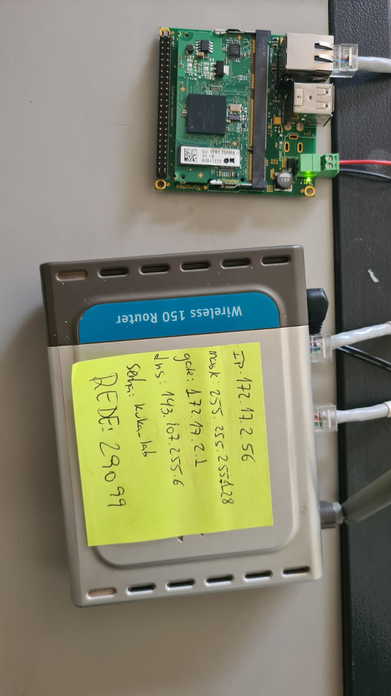

# Squadrone

Desenvolvimento do controle de um motor de drone a partir de uma Colibri VF50, através dos pinos de PWM disponíveis.

## Materiais

* Toradex Colibri VF50
* Toradex Viola Carrier Board
* Motor Brushless
* ESC
* Fonte 5V
* Cabo Ethernet
* Roteador Wi-fi

## Montagem

Primeiramente é necessário conectar o sistema embarcado (target) e o computador de desenvolvimento (host) na mesma rede LAN, utilizando o protocolo ssh. Segue na imagem abaixo a montagem do sistema:

# Squadrone

Desenvolvimento do controle de um motor de drone a partir de uma Colibri VF50, através dos pinos de PWM disponíveis.

## Materiais

* Toradex Colibri VF50
* Toradex Viola Carrier Board
* Motor Brushless
* ESC
* Fonte 5V
* Cabo Ethernet
* Roteador Wi-fi

## Montagem

Primeiramente é necessário conectar o sistema embarcado (target) e o computador de desenvolvimento (host) na mesma rede LAN, utilizando o protocolo ssh. Segue na imagem abaixo a montagem do sistema:

Com o host conectado no wi-fi, abra um terminal e digite o seguinte comando:

``` ip -a  ```
Busque pela interface wlp3s0

Em seguida execute o comando 

```sudo arp-scan --localhost --interface=wlp3s0```

(Adicionar imagem do terminal)

Copie o IP indicado para a toradex e execute o comando

```ssh root@<IP toradex>```

Com isso, o terminal passa agora a operar no target

(imagem do terminal)

# Squadrone

Desenvolvimento do controle de um motor de drone a partir de uma Colibri VF50, através dos pinos de PWM disponíveis.

## Materiais

* Toradex Colibri VF50
* Toradex Viola Carrier Board
* Motor Brushless
* ESC
* Fonte 5V
* Cabo Ethernet
* Roteador Wi-fi

## Montagem

Primeiramente é necessário conectar o sistema embarcado (target) e o computador de desenvolvimento (host) na mesma rede LAN, utilizando o protocolo ssh. Segue na imagem abaixo a montagem do sistema:



Com o host conectado no wi-fi, abra um terminal e digite o seguinte comando:

``` ip -a  ```
Busque pela interface wlp3s0

Em seguida execute o comando 

```sudo arp-scan --localhost --interface=wlp3s0```

(Adicionar imagem do terminal)

Copie o IP indicado para a toradex e execute o comando

```ssh root@<IP toradex>```

Com isso, o terminal passa agora a operar no target

(imagem do terminal)

Com o host conectado no wi-fi, abra um terminal e digite o seguinte comando:

``` ip -a  ```
Busque pela interface wlp3s0

Em seguida execute o comando 

```sudo arp-scan --localhost --interface=wlp3s0```

(Adicionar imagem do terminal)

Copie o IP indicado para a toradex e execute o comando

```ssh root@<IP toradex>```

Com isso, o terminal passa agora a operar no target

(imagem do terminal)

